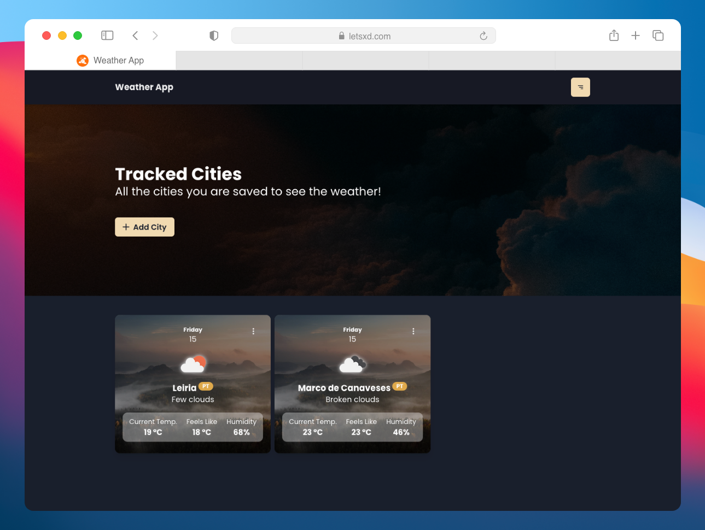
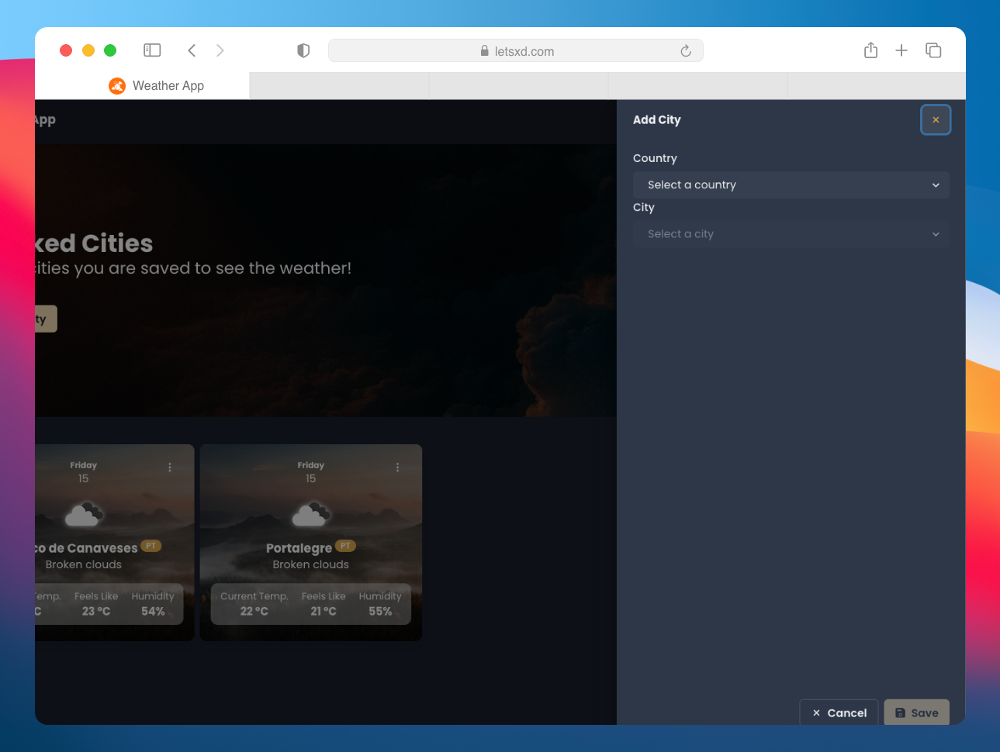
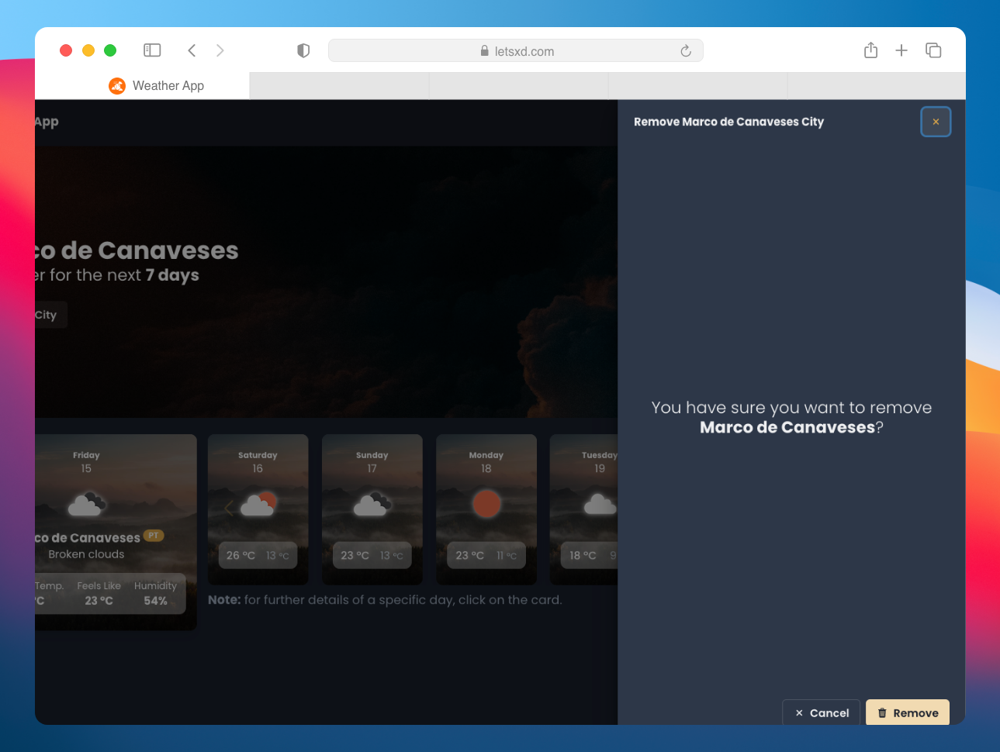
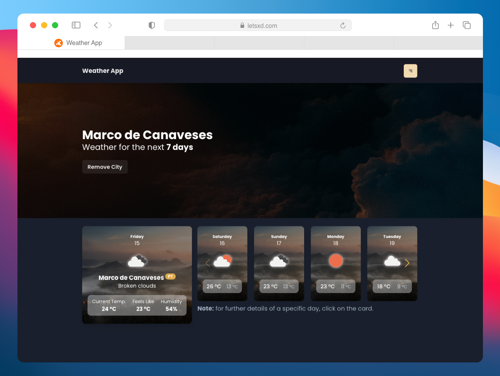

<div align="center">

</div>

<h1 align="center">React Weather App</h1>
<p align="center" style="margin:0">This repository contain a <strong>React</strong> project using the <strong>Open Weather Map</strong> API.</p>
<p align="center">This project are created to a <strong>xgeeks</strong> challenge.</p>

<div align="center">


</div>

<br /><br />

<h2>💡 What you will found?</h2>

You can found the folders below:

```
.
├── public
└── src
    ├── assets
    │   ├── styles
    │   └── media
    ├── components
    ├── contexts
    ├── pages
    │   └── Main
    └── shared
        ├── @types
        ├── hooks
        ├── services
        └── utils
```

<h3 style="font-weight: 300">🗂 Details</h3>

> **`public`:** files you want each user can access, like images, favicon, etc.

> **`src/assets`:** on this folder I save my global styles (`global.scss`) and project media (SVG files, images, ...)

> **`src/components`:** all the components to this project

> **`src/contexts`:** in some applications I use contexts, so this folder is for them

> **`src/pages`:** usually I use `react-router-dom` package, and for that, the `Main/index.tsx` is the file with all routes, and to each page I create another folder and respective files in `src/pages`

> **`src/shared/@types`:** you can imagine that is the folder to storage all the types created for this project (yes, I use Typescript!)

> **`src/shared/hooks`:** folder to storage custom hooks

> **`src/shared/services`:** folder to storage external services, usually with `axios` package

> **`src/shared/utils`:** common functions, regex's, etc.

<h3 style="font-weight: 300">📄 Files</h3>

In this boilerplate you can found this initial files:

> **`.webpack.config.js`:** **Webpack** config to run the web server and build the project

> **`.dockerignore`, `Dockerfile` and `docker-compose.yml`:** files related with Docker (if you want create a container)
> <small>In this case, I create only the image to run a dev server (not a build server)</small>

> **`.prettierrc` and `.prettierignore`:** **Prettier** configuration files;

> **`tsconfig.json`:** My configurations to **TypeScript** <small>(I use `baseUrl` option to clean the imports)</small>

<h2 style="font-weight: 300">⚔️ Original Challenge</h2>

If you have interest on details about the original challenge you can see the [`assignment.md` file](./assignment.md).

<h2 style="font-weight: 3000">📸 Final Result</h2>

<div align="center">
<h3 style="font-weight: 300">Homepage</h3>


<h3 style="font-weight: 300">Add a new City</h3>


<h3 style="font-weight: 300">Remove one City</h3>


<h3 style="font-weight: 300">View City Weather for the next 7 days</h3>


<h3 style="font-weight: 300">View more details about specific day</h3>

</div>

<h2 style="font-weight: 300">🧾 To Do / Improvements</h2>

-   [x] ~Make the app responsive~
-   [x] ~Add **Docker** configuration files~
-   [ ] Use **Redux**
-   [ ] Create tests
-   [x] ~Add **ESLint**~

<br /><br />

<div align="right" style="margin-top: 50px">
<h3 style="font-weight: 300">
🧑🏻‍💻 About Me
</h3>

<a href="https://github.com/TutoDS" alt="TutoDS">

<br />
 <sub><b>Daniel Sousa @TutoDS</b></sub>
</a>

<div style="margin: 20px 0" />

[facebook]: https://facebook.com/tutods2014
[twitter]: https://twitter.com/tutods
[youtube]: https://youtube.com/tutods2014
[instagram]: https://instagram.com/dsousa_12
[linkedin]: https://www.linkedin.com/in/daniel-sousa-tutods/
[gitlab]: https://gitlab.com/jdaniel.asousa

[][facebook] [][twitter]

[][linkedin] [][instagram]

[][youtube] [][gitlab]

</div>
